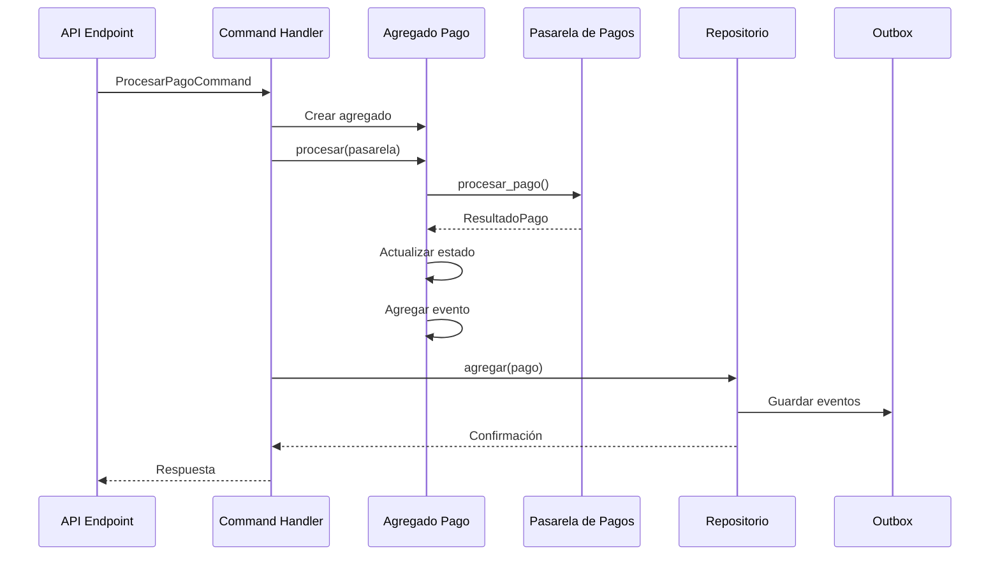

# Microservicio de Pagos - Aeropartners

## Descripción del Servicio

Este microservicio implementa el **"Microservicio de Pagos"** para la plataforma "Alpes Partners", siguiendo los principios de **Domain-Driven Design (DDD)** y **Arquitectura Hexagonal**. El servicio está diseñado para manejar el procesamiento de pagos a afiliados con alta concurrencia y consistencia de datos.

### Escenario de Calidad #6: Procesamiento Concurrente de Pagos

El servicio implementa el escenario de procesamiento concurrente de pagos, validando la capacidad del sistema para orquestar un alto volumen de transacciones con una pasarela de pagos externa de manera eficiente y resiliente.

## Arquitectura y Decisiones de Diseño

### 1. Domain-Driven Design (DDD)

**Agregado Principal: `Pago`**
- Modela el ciclo de vida completo del pago con estados: `PENDIENTE`, `PROCESANDO`, `EXITOSO`, `FALLIDO`
- Protege las invariantes de negocio (no se puede procesar un pago ya procesado)
- Contiene la lógica de transición de estados y generación de eventos de dominio

**Objetos de Valor:**
- `Dinero`: Encapsula monto y moneda con validaciones
- `Moneda`: Enum con monedas soportadas (USD, EUR, COP)

**Eventos de Dominio:**
- `PagoExitoso`: Se emite cuando un pago se procesa exitosamente
- `PagoFallido`: Se emite cuando un pago falla con el mensaje de error

### 2. Arquitectura Hexagonal (Puertos y Adaptadores)

**Puerto: `PasarelaDePagos`**
- Define la interfaz abstracta para la comunicación con pasarelas de pago externas
- Permite intercambiar implementaciones sin afectar el dominio

**Adaptador: `StripeAdapter`**
- Implementa el puerto `PasarelaDePagos`
- Simula llamadas HTTP a la API de Stripe con latencia y fallos aleatorios
- Retorna `ResultadoPago` con éxito/fallo y mensajes de error

### 3. Patrón Outbox con Apache Pulsar

**Implementación:**
- Al persistir el agregado `Pago`, los eventos se guardan en la tabla `outbox` en la misma transacción
- Un procesador separado (`PulsarOutboxProcessor`) lee y publica los eventos a Apache Pulsar
- Un consumidor (`PulsarEventConsumer`) procesa los eventos publicados
- Garantiza consistencia entre el estado del pago y la publicación de eventos

**Beneficios:**
- Evita problemas de consistencia eventual
- Permite reintentos en caso de fallos en la publicación
- Mantiene el orden de los eventos
- Escalabilidad horizontal con múltiples consumidores
- Durabilidad y persistencia de mensajes
- Integración con sistemas externos

### 4. CQS (Command Query Separation)

**Comandos:**
- `ProcesarPagoCommand`: Inicia el flujo de procesamiento de pago
- `ProcesarPagoHandler`: Maneja la lógica de negocio del comando

**Consultas:**
- `ObtenerEstadoPagoQuery`: Consulta el estado actual de un pago
- `ObtenerEstadoPagoHandler`: Retorna la información del pago

## Diagrama de Secuencia del Flujo de Pago



## Stack Tecnológico

- **Lenguaje:** Python 3.11+
- **Framework:** FastAPI
- **Base de Datos:** PostgreSQL 15
- **ORM:** SQLAlchemy 2.0
- **Migraciones:** Alembic
- **Mensajería:** Apache Pulsar 3.1.0
- **Contenerización:** Docker y Docker Compose
- **Validación:** Pydantic

## Guía de Despliegue

### Prerrequisitos

- Docker y Docker Compose instalados
- Git (para clonar el repositorio)

### Pasos de Despliegue

1. **Clonar el repositorio:**
```bash
git clone <repository-url>
cd entrega-3
```

2. **Configurar variables de entorno (opcional):**
```bash
cp env.example .env
# Editar .env si es necesario
```

3. **Levantar los servicios:**
```bash
docker-compose up -d
```

4. **Verificar que los servicios estén funcionando:**
```bash
docker-compose ps
```

5. **Acceder a la documentación de la API:**
- Swagger UI: http://localhost:8000/docs
- ReDoc: http://localhost:8000/redoc

### Servicios Incluidos

- **aeropartners**: Aplicación principal (puerto 8000)
- **postgres**: Base de datos PostgreSQL (puerto 5432)
- **pulsar**: Apache Pulsar (puertos 6650, 8080)
- **outbox-processor**: Procesador de eventos con Pulsar
- **pulsar-consumer**: Consumidor de eventos de Pulsar

## Uso de la API

### 1. Procesar un Pago

```bash
curl -X POST "http://localhost:8000/pagos/" \
  -H "Content-Type: application/json" \
  -d '{
    "id_afiliado": "afiliado_123",
    "monto": 100.50,
    "moneda": "USD"
  }'
```

**Respuesta:**
```json
{
  "id_pago": "550e8400-e29b-41d4-a716-446655440000",
  "id_afiliado": "afiliado_123",
  "monto": 100.5,
  "moneda": "USD",
  "estado": "EXITOSO",
  "referencia_pago": "ref_123456",
  "fecha_creacion": "2024-01-01T10:00:00",
  "mensaje": "Pago procesado exitosamente"
}
```

### 2. Consultar Estado de un Pago

```bash
curl -X GET "http://localhost:8000/pagos/550e8400-e29b-41d4-a716-446655440000"
```

**Respuesta:**
```json
{
  "id": "550e8400-e29b-41d4-a716-446655440000",
  "id_afiliado": "afiliado_123",
  "monto": 100.5,
  "moneda": "USD",
  "estado": "EXITOSO",
  "referencia_pago": "ref_123456",
  "fecha_creacion": "2024-01-01T10:00:00",
  "fecha_procesamiento": "2024-01-01T10:00:05",
  "mensaje_error": null
}
```

### 3. Obtener Estadísticas del Outbox

```bash
curl -X GET "http://localhost:8000/pagos/outbox/estadisticas"
```

**Respuesta:**
```json
{
  "total_eventos": 10,
  "eventos_procesados": 8,
  "eventos_pendientes": 2
}
```

## Apache Pulsar

### Configuración

El microservicio incluye Apache Pulsar para el manejo robusto de eventos:

- **URL de Pulsar**: `pulsar://localhost:6650`
- **Admin URL**: `http://localhost:8080`
- **Topic**: `pagos-events`
- **Subscription**: `aeropartners-consumer`

### Monitoreo de Pulsar

Puedes acceder a la consola de administración de Pulsar en:
- **Pulsar Admin**: http://localhost:8080
- **Topic Stats**: http://localhost:8080/admin/v2/persistent/public/default/pagos-events/stats

### Eventos Publicados

El sistema publica los siguientes eventos a Pulsar:

#### PagoExitoso
```json
{
  "event_type": "PagoExitoso",
  "event_id": "uuid",
  "timestamp": "2024-01-01T10:00:00",
  "data": {
    "id_pago": "uuid",
    "id_afiliado": "afiliado_123",
    "monto": 100.50,
    "moneda": "USD",
    "referencia_pago": "ref_123456"
  }
}
```

#### PagoFallido
```json
{
  "event_type": "PagoFallido",
  "event_id": "uuid",
  "timestamp": "2024-01-01T10:00:00",
  "data": {
    "id_pago": "uuid",
    "id_afiliado": "afiliado_123",
    "monto": 100.50,
    "moneda": "USD",
    "referencia_pago": "ref_123456",
    "mensaje_error": "Fondos insuficientes"
  }
}
```

## Estructura del Proyecto

```
src/aeropartners/
├── api/                    # Capa de presentación (FastAPI)
│   └── pagos.py
├── modulos/
│   └── pagos/
│       ├── aplicacion/     # Capa de aplicación (CQS)
│       │   ├── comandos.py
│       │   ├── queries.py
│       │   └── handlers.py
│       ├── dominio/        # Capa de dominio (DDD)
│       │   ├── entidades.py
│       │   ├── eventos.py
│       │   ├── reglas.py
│       │   ├── repositorios.py
│       │   └── servicios.py
│       └── infraestructura/ # Capa de infraestructura
│           ├── adaptadores.py
│           ├── modelos.py
│           ├── mapeadores.py
│           ├── outbox.py
│           └── pulsar_consumer.py
├── seedwork/              # Código reutilizable
│   ├── aplicacion/
│   ├── dominio/
│   └── infraestructura/
│       ├── db.py
│       └── pulsar_producer.py
└── main.py               # Punto de entrada de la aplicación
```

## Características Técnicas

### Resiliencia
- Manejo de errores en la pasarela de pagos
- Reintentos automáticos en el procesador de outbox
- Validaciones de reglas de negocio
- Durabilidad de mensajes con Apache Pulsar
- Shutdown graceful de consumidores

### Escalabilidad
- Arquitectura hexagonal permite intercambiar adaptadores
- Separación clara de responsabilidades
- Procesamiento asíncrono de eventos
- Múltiples consumidores de Pulsar
- Particionado automático de topics

### Observabilidad
- Logs detallados del procesamiento de eventos
- Endpoints de monitoreo del outbox
- Consola de administración de Pulsar
- Métricas de throughput y latencia
- Documentación automática de la API

### Integración
- Apache Pulsar para mensajería robusta
- Patrón Outbox para consistencia transaccional
- API REST con FastAPI
- Base de datos PostgreSQL con migraciones

## Equipo: MicroTeam 4.0
