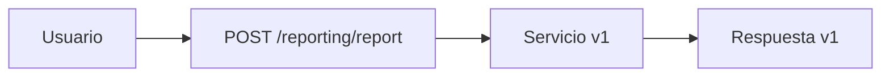
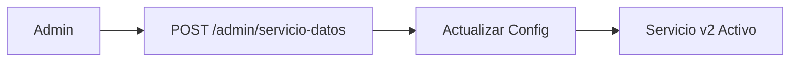
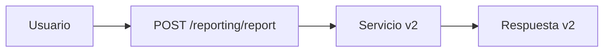

# Servicio de Reporting - Aeropartners

## Descripción

El **Servicio de Reporting** implementa la funcionalidad de generación de reportes con la capacidad de **cambio sin interrupción** entre diferentes versiones de servicios de datos. Este servicio demuestra cómo realizar migraciones graduales y actualizaciones sin downtime.

## Características Principales

### 🔄 **Cambio Sin Interrupción**
- **Endpoint de Lógica de Negocio**: `/reporting/report` - Genera reportes sin conocer la versión del servicio de datos
- **Endpoint de Administración**: `/reporting/admin/servicio-datos` - Cambia la configuración del servicio de datos instantáneamente
- **Transición Fluida**: Los usuarios no notan el cambio entre v1 y v2

### 🏗️ **Arquitectura DDD**
- **Capa de Dominio**: Entidades, Objetos de Valor, Servicios de Dominio
- **Capa de Aplicación**: Comandos, Queries, Handlers (CQRS)
- **Capa de Infraestructura**: Repositorios, Adaptadores, Modelos de BD

### 📊 **Tipos de Reportes**
- `pagos_por_periodo` - Reportes de pagos por período
- `campanas_activas` - Reportes de campañas activas
- `metricas_generales` - Métricas generales del sistema

## Arquitectura del Sistema

```
┌─────────────────┐    ┌──────────────────┐    ┌─────────────────┐
│   Usuario       │    │  Servicio de     │    │  Servicio de    │
│   Final         │───▶│  Reporting       │───▶│  Datos (v1/v2)  │
└─────────────────┘    └──────────────────┘    └─────────────────┘
                              │
                              ▼
                       ┌──────────────────┐
                       │  Administrador   │
                       │  (Cambio v1→v2)  │
                       └──────────────────┘
```

## Endpoints Disponibles

### 🎯 **Endpoint Principal de Lógica de Negocio**

#### `POST /reporting/report`
Genera un reporte usando el servicio de datos configurado actualmente.

**Request:**
```json
{
  "tipo_reporte": "pagos_por_periodo",
  "filtros": {
    "fecha_inicio": "2024-01-01",
    "fecha_fin": "2024-01-31",
    "moneda": "USD"
  }
}
```

**Response:**
```json
{
  "id": "pagos_20240115_103000",
  "tipo": "pagos_por_periodo",
  "fecha_generacion": "2024-01-15T10:30:00Z",
  "datos": { ... },
  "metadatos": { ... },
  "version_servicio_datos": "v1"
}
```

### ⚙️ **Endpoint de Administración**

#### `POST /reporting/admin/servicio-datos`
Cambia el servicio de datos sin interrupción del servicio.

**Request:**
```json
{
  "url": "http://servicio-datos-v2:8000",
  "version": "v2"
}
```

**Response:**
```json
{
  "mensaje": "Servicio de datos actualizado exitosamente",
  "url": "http://servicio-datos-v2:8000",
  "version": "v2",
  "fecha_actualizacion": "2024-01-15T10:30:00Z"
}
```

### 📋 **Endpoints de Consulta**

- `GET /reporting/report/{reporte_id}` - Obtener reporte por ID
- `GET /reporting/reports` - Listar reportes con filtros
- `GET /reporting/admin/configuracion` - Obtener configuración actual
- `GET /reporting/admin/verificar-servicio` - Verificar conectividad
- `GET /reporting/health` - Health check

## Cómo Funciona el Cambio Sin Interrupción

### 1. **Estado Inicial**


### 2. **Cambio de Configuración**


### 3. **Nuevas Peticiones**


## Ejecución y Pruebas

### 1. **Levantar el Servicio**
```bash
cd entrega-final
docker-compose up -d
```

### 2. **Ejecutar Script de Prueba**
```bash
python scripts/test_reporting.py
```

### 3. **Pruebas Manuales con curl**

#### Generar reporte:
```bash
curl -X POST "http://localhost:8000/reporting/report" \
  -H "Content-Type: application/json" \
  -d '{
    "tipo_reporte": "pagos_por_periodo",
    "filtros": {
      "fecha_inicio": "2024-01-01",
      "fecha_fin": "2024-01-31"
    }
  }'
```

#### Cambiar a servicio v2:
```bash
curl -X POST "http://localhost:8000/reporting/admin/servicio-datos" \
  -H "Content-Type: application/json" \
  -d '{
    "url": "http://servicio-datos-v2:8000",
    "version": "v2"
  }'
```

## Estructura del Proyecto

```
src/aeropartners/modulos/reporting/
├── dominio/
│   ├── entidades.py          # Reporte, ConfiguracionServicioDatos
│   ├── objetos_valor.py      # FiltrosReporte, MetricaReporte
│   ├── repositorios.py       # Interfaces de repositorios
│   └── servicios.py          # Servicios de dominio
├── aplicacion/
│   ├── comandos.py           # Comandos CQRS
│   ├── queries.py            # Queries CQRS
│   └── handlers.py           # Handlers de comandos y queries
├── infraestructura/
│   ├── adaptadores.py        # Adaptadores para servicios externos
│   ├── repositorios.py       # Implementaciones de repositorios
│   └── modelos.py            # Modelos de base de datos
└── api/
    └── reporting.py          # Endpoints FastAPI
```

## Ventajas del Diseño

### ✅ **Sin Interrupción del Servicio**
- Los usuarios pueden seguir generando reportes durante el cambio
- No hay downtime ni pérdida de datos
- La transición es transparente

### ✅ **Flexibilidad**
- Fácil cambio entre versiones de servicios
- Soporte para múltiples proveedores de datos
- Configuración dinámica

### ✅ **Mantenibilidad**
- Separación clara de responsabilidades
- Código testeable y modular
- Fácil extensión para nuevos tipos de reportes

### ✅ **Observabilidad**
- Logs detallados de cambios de configuración
- Métricas de uso de servicios
- Trazabilidad completa

## Casos de Uso

1. **Migración Gradual**: Cambiar de un servicio legacy a uno moderno
2. **A/B Testing**: Probar diferentes versiones de servicios
3. **Failover**: Cambiar a un servicio de respaldo en caso de fallos
4. **Actualizaciones**: Desplegar nuevas versiones sin interrupción
5. **Multi-tenant**: Diferentes clientes con diferentes servicios de datos

## Monitoreo

- **Health Check**: `GET /reporting/health`
- **Configuración**: `GET /reporting/admin/configuracion`
- **Verificación**: `GET /reporting/admin/verificar-servicio`
- **Logs**: Revisar logs del contenedor para seguimiento

## Conclusión

El Servicio de Reporting demuestra cómo implementar **cambio sin interrupción** en microservicios, permitiendo migraciones graduales y actualizaciones transparentes. Esta arquitectura es especialmente valiosa en entornos de producción donde la disponibilidad es crítica.
