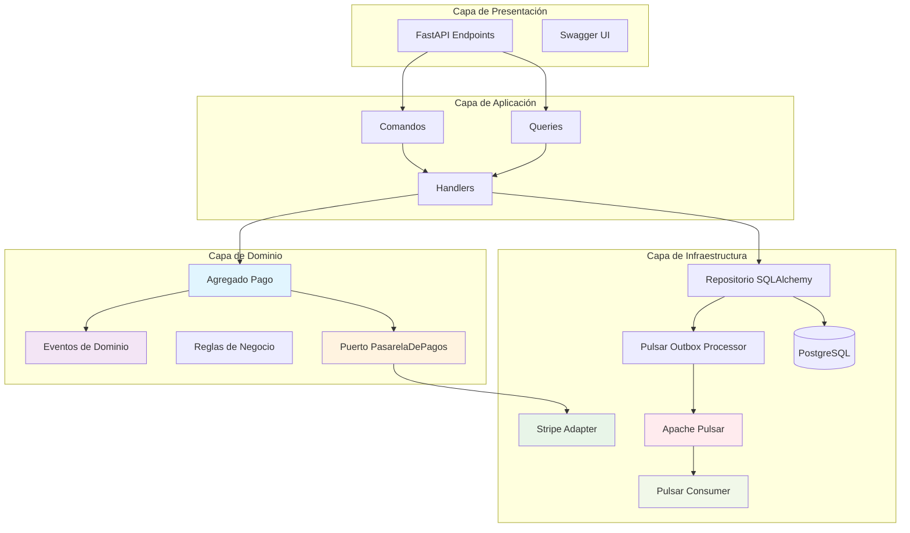
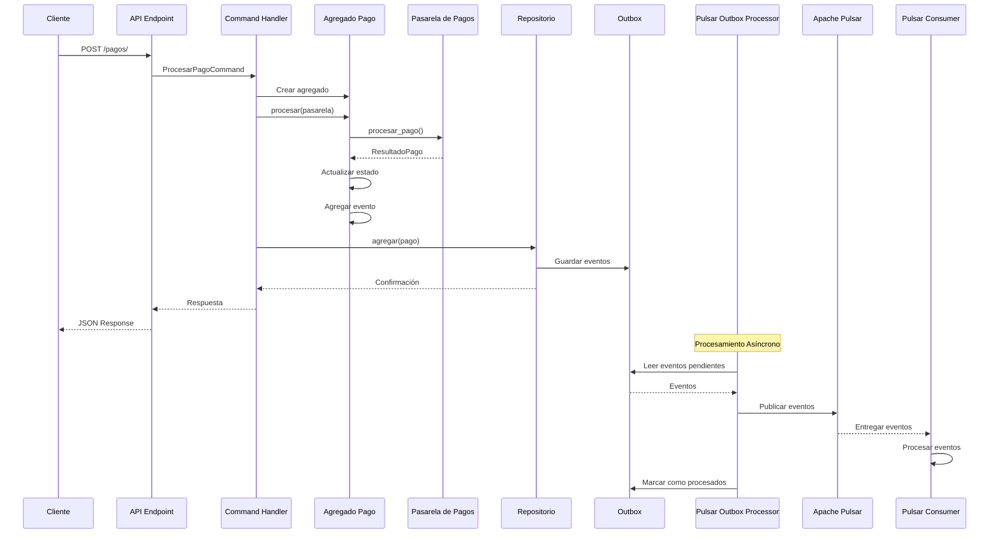
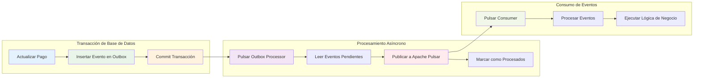
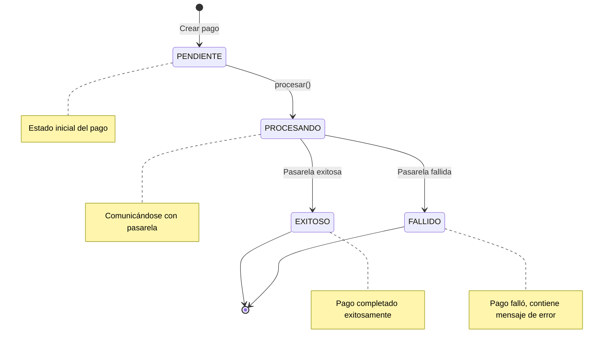

# Arquitectura del Microservicio de Pagos

## Diagrama de Arquitectura Hexagonal

## Flujo de Procesamiento de Pagos

## Patrón Outbox con Apache Pulsar

## Estados del Agregado Pago

## Componentes del Sistema

### Capa de Dominio
- **Agregado Pago**: Entidad principal que encapsula la lógica de negocio
- **Eventos de Dominio**: PagoExitoso, PagoFallido
- **Reglas de Negocio**: Validaciones de estado y transiciones
- **Puerto PasarelaDePagos**: Interfaz abstracta para pasarelas externas

### Capa de Aplicación
- **Comandos**: ProcesarPagoCommand
- **Queries**: ObtenerEstadoPagoQuery
- **Handlers**: Lógica de orquestación entre dominio e infraestructura

### Capa de Infraestructura
- **Repositorio**: Persistencia con SQLAlchemy
- **Adaptador Stripe**: Implementación mock de la pasarela
- **Pulsar Outbox Processor**: Procesamiento asíncrono de eventos con Pulsar
- **Pulsar Event Consumer**: Consumidor de eventos de Pulsar
- **Base de Datos**: PostgreSQL con tablas pagos y outbox
- **Apache Pulsar**: Sistema de mensajería distribuida

### Capa de Presentación
- **FastAPI**: Endpoints REST con documentación automática
- **Swagger UI**: Interfaz de documentación interactiva
